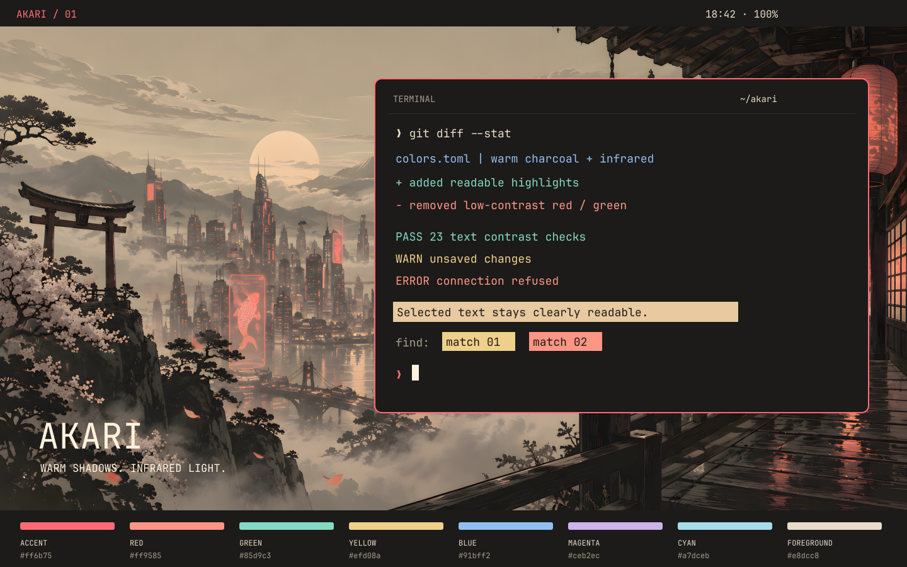

# Akari

A warm, dark Omarchy theme inspired by lantern-lit streets and a hazy Japanese skyline. Charcoal backgrounds, sandy text, infrared accents and soft teal highlights.



*Concept preview, not a desktop screenshot.*

## Install

Requires Omarchy with `colors.toml` support and generated app themes.

```bash
omarchy theme install https://github.com/marco-kretz/omarchy-theme-akari.git
```

Omarchy derives the installed theme name from the repository name. Its current installer strips `omarchy-`, so this repository appears as **Theme Akari** (`theme-akari`). Repository installs use the generated Hyprland configuration; Omarchy does not load a cloned theme's Lua files.

### Local development and rounded corners

To use the name **Akari**, edit the theme locally, and enable its 8px window corners, clone it outside Omarchy's themes directory and link the checkout:

```bash
git clone https://github.com/marco-kretz/omarchy-theme-akari.git
cd omarchy-theme-akari
mkdir -p ~/.config/omarchy/themes
ln -s "$PWD" ~/.config/omarchy/themes/akari
omarchy theme set akari
```

For an existing checkout, run only the last three commands from its directory. Reapply `omarchy theme set akari` after edits; generated app configurations do not update on save. Omarchy loads `hyprland.lua` from this trusted local symlink. Its border accent matches `colors.toml`; update both if changing that accent.

## App support

The palette uses Omarchy's built-in templates rather than maintaining separate copies for every app.

| Apps | Integration |
| --- | --- |
| Alacritty, Ghostty, Kitty, Foot | ANSI palette, selection and cursor |
| Neovim, Helix | Generated editor themes |
| VS Code, VSCodium, Cursor, VS Code Insiders | Generated Omarchy theme, unless theme syncing is disabled |
| btop | Generated color theme |
| Chromium, Chrome, Brave, Edge | Charcoal browser base color; the browser derives its UI colors |
| Omarchy shell, Hyprland, screen-share picker, Gum | Surface and accent colors |
| Obsidian | Generated CSS; select **Omarchy** in the vault |
| Claude Code, Pi | Generated themes; select the Omarchy theme in the app |
| tmux | Terminal colors and theme environment |
| GTK apps | Adwaita-dark with Yaru-yellow icons |
| Supported RGB keyboards | Generated keyboard color, applied by Omarchy's hardware integration |

Integration depends on the installed Omarchy version and app configuration. GTK uses the standard dark theme, not a custom Akari stylesheet. Browser colors affect browser chrome, not website content. Apps with their own Truecolor themes may ignore the terminal palette.

## Wallpapers

Two wallpapers are included in `backgrounds/`, both at 3840 × 2160:

- `01-akari-4k.png`: the original hillside panorama.
- `02-akari-canal-4k.png`: a lantern-lit canal through the old town.

Choose either in Omarchy's wallpaper selector, or cycle with `omarchy theme bg next`. Both scale to lower-resolution displays.

## Readability

Infrared `#ff6b75` is the accent; small error text uses lighter coral `#ff9585`. ANSI green is a blue-leaning teal to help distinguish it from coral. Selections use dark text on sand, and comments remain deliberately bright.

| Text on the opaque background | sRGB contrast |
| --- | ---: |
| Default | 12.71:1 |
| Muted / comments | 6.37:1 |
| Error | 8.11:1 |
| Infrared accent | 6.24:1 |

All 23 checked text/background pairs reach at least 4.5:1. Run the check with Python 3.11+:

```bash
python3 check_palette.py
```

These measurements are not a color-vision accessibility certification. [Red on dark backgrounds can remain difficult with protanopia](https://www.w3.org/WAI/WCAG21/Understanding/contrast-minimum.html); applications should also [convey meaning through labels or symbols](https://w3c.github.io/wcag/understanding/use-of-color). ANSI black intentionally matches the background. Transparency, dimming and application-defined colors can change contrast. Testing with affected users is still needed.

## Preview

The editable concept preview is `preview.svg`. Regenerate its PNG with librsvg:

```bash
rsvg-convert preview.svg -o preview.png
```
